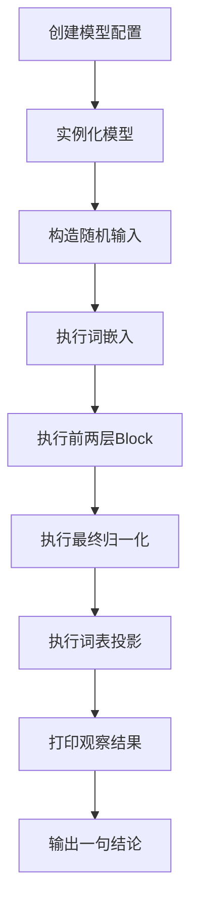

# Day2 测试脚本实现计划

## 目标

你今天不是去写一个完整训练脚本，而是自己写一个“小型观察脚本”，专门用来验证：

- `MiniMind` 模型能不能正常实例化
- 一个 `token` 进入后，张量形状怎么变化
- `Embedding`
- `Attention`
- `Block`
- `lm head`

最终目的不是做性能测试，而是做“结构理解测试”。

换句话说，这个脚本更像一个“模型结构观察器”，不是一个正式产品脚本。

## 这个脚本要达到的效果

你运行脚本后，至少能看到这些信息：

1. 模型配置是否加载成功
2. 随机输入的 `input_ids` 形状
3. `Embedding` 后的张量形状
4. 前两层 `Block` 后的张量形状
5. 最终 `logits` 的形状
6. 你能据此确认：
   - 每层在加工 `hidden states`
   - 最后才映射到词表空间

## 类比理解

这个脚本可以理解成你自己给模型做的一个“调试面板”。

- 模型本体像游戏里的渲染管线
- 你的测试脚本像一个运行时调试窗口
- 它不负责创造内容
- 它负责告诉你每一站经过后，数据长什么样

所以这不是“做功能”，而是在“看血条和状态面板”。

## 推荐脚本名称

建议放在项目根目录，文件名用：

`day2_model_probe.py`

原因：

- 名字直接说明用途
- 后续 Day 3 Day 4 也可以继续扩展成 `day3_tokenizer_probe.py` 这种风格

## 第一版脚本的最小功能

第一版只做 4 件事：

1. 创建一个最小 `MiniMindConfig`
2. 实例化 `MiniMindForCausalLM`
3. 构造一组随机 `input_ids`
4. 手动打印关键阶段的形状

只要这 4 件事做完，你今天的 Day 2 脚本就已经合格。

## 推荐实现步骤

### 第一步 先实现最小可运行版本

你先只写下面这类逻辑：

```python
from model.model_minimind import MiniMindConfig, MiniMindForCausalLM
import torch

cfg = MiniMindConfig(hidden_size=768, num_hidden_layers=8, use_moe=False)
model = MiniMindForCausalLM(cfg).eval()

input_ids = torch.randint(0, cfg.vocab_size, (1, 8))
```

这一步的目的只有一个：

- 先确认模型能创建成功

验收标准：

- 脚本运行时不报导入错误
- 能输出模型类型和配置

### 第二步 打印主干关键形状

你接着补这几步：

- 打印 `input_ids.shape`
- 打印 `embed_tokens` 之后的形状
- 打印前两层 `Block` 输出形状
- 打印 `final norm` 后形状
- 打印 `lm_head` 后 `logits` 形状

这一步最重要。

因为 Day 2 最难的地方，不是公式，而是你脑子里没有”张量流动路径”。

你一旦看到这些形状，就会立刻知道：

- 词表维度不是每层都在变
- 真正持续流动的是 `hidden_size`

对应代码：

```python
def inspect_main_flow(model, input_ids, inspect_blocks=2):
    “””观察主干流程中的关键张量形状。

    整个观察路径是：
    input ids
      -> embedding
      -> 前若干层 block
      -> final norm
      -> lm head
      -> logits

    我们只观察前两层 block，避免输出过长。
    “””
    base = model.model

    # [1] 输入形状
    print(“input_ids shape:”, tuple(input_ids.shape))

    # [2] token id 进入 embedding，变成 hidden states
    #     形状变化: [batch, seq] -> [batch, seq, hidden_size]
    hidden_states = base.embed_tokens(input_ids)
    print(“embedding shape:”, tuple(hidden_states.shape))

    # [3] 为当前序列长度准备对应位置的 RoPE 参数
    #     注意: RoPE 的 cos 和 sin 是预先算好的，这里按位置切片
    position_embeddings = (
        base.freqs_cos[: input_ids.shape[1]],
        base.freqs_sin[: input_ids.shape[1]],
    )

    # [4] 只观察前若干层 block，确认 hidden states 如何在层间流动
    #     每层 block 内部: layernorm -> attention -> 残差 -> layernorm -> mlp -> 残差
    #     但对主链来说，每层输出的形状始终是 [batch, seq, hidden_size]
    for i, layer in enumerate(base.layers[:inspect_blocks]):
        hidden_states, _ = layer(hidden_states, position_embeddings)
        print(f”after block {i + 1} shape:”, tuple(hidden_states.shape))

    # [5] 主干最后还会做一次 RMSNorm
    #     形状不变，仍然是 [batch, seq, hidden_size]
    hidden_states = base.norm(hidden_states)
    print(“final norm shape:”, tuple(hidden_states.shape))

    # [6] 通过 lm_head 映射回词表空间，得到 logits
    #     形状变化: [batch, seq, hidden_size] -> [batch, seq, vocab_size]
    logits = model.lm_head(hidden_states)
    print(“logits shape:”, tuple(logits.shape))

    return logits
```

运行后你应该看到类似这样的输出：

```text
input_ids shape: (1, 8)
embedding shape: (1, 8, 768)
after block 1 shape: (1, 8, 768)
after block 2 shape: (1, 8, 768)
final norm shape: (1, 8, 768)
logits shape: (1, 8, 6400)
```

关键观察点：

| 阶段 | 形状 | 最后一维 |
|------|------|----------|
| input_ids | `[1, 8]` | 无（整数索引） |
| embedding | `[1, 8, 768]` | hidden_size |
| block 1 | `[1, 8, 768]` | hidden_size（不变） |
| block 2 | `[1, 8, 768]` | hidden_size（不变） |
| final norm | `[1, 8, 768]` | hidden_size（不变） |
| logits | `[1, 8, 6400]` | vocab_size（最后一跳） |

你看到的核心规律：**从 embedding 到 final norm，中间所有层的输出维度都是 hidden_size。只有 lm_head 这一步才变成 vocab_size。**

### 第三步 给输出加说明文字

不要只打印：

- `torch.Size([1, 8, 768])`

要打印成这种形式：

- `Embedding 输出 shape`
- `第 1 层 Block 输出 shape`
- `第 2 层 Block 输出 shape`
- `最终 logits shape`

这样你后面回看日志时，不用重新猜每一行是什么意思。

对应代码：

```python
def inspect_main_flow(model, input_ids, inspect_blocks=2):
    """观察主干流程中的关键张量形状（带详细说明）。"""
    base = model.model

    print("=" * 50)
    print("[Day2 Model Probe] 主干张量形状观察")
    print("=" * 50)

    # 打印模型基本信息
    print(f"模型类名: {model.__class__.__name__}")
    print(f"hidden_size: {base.config.hidden_size}")
    print(f"num_hidden_layers: {base.config.num_hidden_layers}")
    print(f"vocab_size: {base.config.vocab_size}")
    print(f"use_moe: {base.config.use_moe}")
    print("-" * 50)

    # [阶段1] 输入
    print(f"[输入] input_ids shape: {tuple(input_ids.shape)}")
    print(f"  含义: batch={input_ids.shape[0]}, seq_len={input_ids.shape[1]}")
    print(f"  数值范围: [{input_ids.min().item()}, {input_ids.max().item()}]")

    # [阶段2] Embedding
    #   token id -> 向量表示
    #   形状变化: [batch, seq] -> [batch, seq, hidden_size]
    hidden_states = base.embed_tokens(input_ids)
    print(f"[Embedding] embed_tokens 输出 shape: {tuple(hidden_states.shape)}")
    print(f"  含义: 每个 token 被表示成一个 {hidden_states.shape[-1]} 维向量")

    # [阶段3] 准备 RoPE 位置编码
    position_embeddings = (
        base.freqs_cos[: input_ids.shape[1]],
        base.freqs_sin[: input_ids.shape[1]],
    )
    print(f"[RoPE] cos shape: {tuple(position_embeddings[0].shape)}, "
          f"sin shape: {tuple(position_embeddings[1].shape)}")

    # [阶段4] Block 层间流动
    #   每层内部: layernorm -> attention -> 残差 -> layernorm -> mlp -> 残差
    #   但主链上，形状始终是 [batch, seq, hidden_size]
    print(f"[Block] 观察前 {inspect_blocks} 层:")
    for i, layer in enumerate(base.layers[:inspect_blocks]):
        hidden_states, _ = layer(hidden_states, position_embeddings)
        print(f"  第 {i + 1} 层 Block 输出 shape: {tuple(hidden_states.shape)}")
        print(f"    统计: mean={hidden_states.mean().item():.4f}, "
              f"std={hidden_states.std().item():.4f}, "
              f"min={hidden_states.min().item():.4f}, "
              f"max={hidden_states.max().item():.4f}")

    # [阶段5] Final RMSNorm
    hidden_states = base.norm(hidden_states)
    print(f"[Norm] final RMSNorm 输出 shape: {tuple(hidden_states.shape)}")
    print(f"  含义: 归一化后维度不变，仍然是 hidden_size={hidden_states.shape[-1]}")

    # [阶段6] lm_head 投影到词表
    #   形状变化: [batch, seq, hidden_size] -> [batch, seq, vocab_size]
    logits = model.lm_head(hidden_states)
    print(f"[lm_head] 最终 logits shape: {tuple(logits.shape)}")
    print(f"  含义: 每个位置对 {logits.shape[-1]} 个词的原始得分")

    print("=" * 50)
    return logits
```

运行后你会看到：

```text
==================================================
[Day2 Model Probe] 主干张量形状观察
==================================================
模型类名: MiniMindForCausalLM
hidden_size: 768
num_hidden_layers: 8
vocab_size: 6400
use_moe: False
--------------------------------------------------
[输入] input_ids shape: (1, 8)
  含义: batch=1, seq_len=8
  数值范围: [42, 6123]
[Embedding] embed_tokens 输出 shape: (1, 8, 768)
  含义: 每个 token 被表示成一个 768 维向量
[RoPE] cos shape: (8, 96), sin shape: (8, 96)
[Block] 观察前 2 层:
  第 1 层 Block 输出 shape: (1, 8, 768)
    统计: mean=0.0123, std=0.9876, min=-2.3456, max=2.7890
  第 2 层 Block 输出 shape: (1, 8, 768)
    统计: mean=0.0098, std=1.0234, min=-2.4567, max=2.8901
[Norm] final RMSNorm 输出 shape: (1, 8, 768)
  含义: 归一化后维度不变，仍然是 hidden_size=768
[lm_head] 最终 logits shape: (1, 8, 6400)
  含义: 每个位置对 6400 个词的原始得分
==================================================
```

### 第四步 增加一个简单结论输出

脚本最后建议主动打印一句总结，例如：

- `结论 当前 hidden states 在层间保持 hidden size 维度 最后才映射到词表`

这一步看起来像多余，其实很重要。

因为它会强迫你把”观察到的现象”写成”理解到的结论”。

对应代码：

```python
def validate_shapes(cfg, input_ids, logits):
    “””做几个最关键的结构断言。

    这些断言不是在测模型效果，而是在测你对结构的理解有没有跑偏。
    如果任何一个断言失败，说明你的理解或模型代码有问题。
    “””
    # input_ids 应该是二维: [batch, seq]
    assert input_ids.dim() == 2, \
        f”input_ids 应该是二维张量 [batch, seq]，实际是 {input_ids.dim()} 维”

    # logits 应该是三维: [batch, seq, vocab]
    assert logits.dim() == 3, \
        f”logits 应该是三维张量 [batch, seq, vocab]，实际是 {logits.dim()} 维”

    # batch 维度应该一致
    assert logits.shape[0] == input_ids.shape[0], \
        f”batch 维度不一致: logits={logits.shape[0]}, input={input_ids.shape[0]}”

    # seq 维度应该一致
    assert logits.shape[1] == input_ids.shape[1], \
        f”seq 维度不一致: logits={logits.shape[1]}, input={input_ids.shape[1]}”

    # logits 最后一维必须等于 vocab_size
    assert logits.shape[2] == cfg.vocab_size, \
        f”logits 最后一维不等于 vocab_size: {logits.shape[2]} != {cfg.vocab_size}”

    print(“[断言] 所有形状断言通过”)


def print_summary(cfg, input_ids, logits):
    “””打印最终观察结论。”””
    print(“\n” + “=” * 50)
    print(“[Summary] Day2 观察结论”)
    print(“=” * 50)
    print(f”  hidden_size = {cfg.hidden_size}”)
    print(f”  num_hidden_layers = {cfg.num_hidden_layers}”)
    print(f”  vocab_size = {cfg.vocab_size}”)
    print(f”  input batch = {input_ids.shape[0]}”)
    print(f”  input seq_len = {input_ids.shape[1]}”)
    print(f”  logits 最后一维 == vocab_size: “
          f”{logits.shape[-1] == cfg.vocab_size}”)
    print(“-” * 50)
    print(“  结论:”)
    print(“    1. token id 经 embedding 变成 hidden_size 维向量”)
    print(“    2. hidden states 在所有 block 层间始终保持 hidden_size 维度”)
    print(“    3. 只有最后的 lm_head 才将 hidden_size 映射到 vocab_size”)
    print(“    4. 这就是 Transformer 语言模型的主链数据流”)
    print(“=” * 50)
```

运行后你会看到：

```text
[断言] 所有形状断言通过

==================================================
[Summary] Day2 观察结论
==================================================
  hidden_size = 768
  num_hidden_layers = 8
  vocab_size = 6400
  input batch = 1
  input seq_len = 8
  logits 最后一维 == vocab_size: True
--------------------------------------------------
  结论:
    1. token id 经 embedding 变成 hidden_size 维向量
    2. hidden states 在所有 block 层间始终保持 hidden_size 维度
    3. 只有最后的 lm_head 才将 hidden_size 映射到 vocab_size
    4. 这就是 Transformer 语言模型的主链数据流
==================================================
```

## 推荐脚本结构

建议拆成下面几个函数：

```text
main
  -> create model
  -> build input
  -> inspect embedding
  -> inspect blocks
  -> inspect logits
  -> print summary
```

这样好处是：

- 结构清晰
- 后续容易继续扩展
- 不会把所有逻辑都塞进 `main`

## 推荐的代码组织方式

你可以按下面的样子组织：

```python
import torch
from pathlib import Path
import sys

# 让脚本在 test 目录下直接运行时，也能找到项目根目录里的 model 包。
PROJECT_ROOT = Path(__file__).resolve().parents[1]
if str(PROJECT_ROOT) not in sys.path:
    sys.path.insert(0, str(PROJECT_ROOT))

from model.model_minimind import MiniMindConfig, MiniMindForCausalLM


def build_model():
    """创建一个最小可观察的 MiniMind 模型。"""
    cfg = MiniMindConfig(
        hidden_size=768,
        num_hidden_layers=8,
        use_moe=False,
    )
    model = MiniMindForCausalLM(cfg).eval()
    return cfg, model


def build_dummy_input(cfg, batch_size=1, seq_len=8):
    """构造一组随机 token id。"""
    input_ids = torch.randint(0, cfg.vocab_size, (batch_size, seq_len))
    return input_ids


def inspect_main_flow(model, input_ids, inspect_blocks=2):
    """观察主干流程中的关键张量形状（带详细说明）。"""
    base = model.model

    print("=" * 50)
    print("[Day2 Model Probe] 主干张量形状观察")
    print("=" * 50)

    print(f"模型类名: {model.__class__.__name__}")
    print(f"hidden_size: {base.config.hidden_size}")
    print(f"num_hidden_layers: {base.config.num_hidden_layers}")
    print(f"vocab_size: {base.config.vocab_size}")
    print("-" * 50)

    # [阶段1] 输入
    print(f"[输入] input_ids shape: {tuple(input_ids.shape)}")

    # [阶段2] Embedding: [batch, seq] -> [batch, seq, hidden_size]
    hidden_states = base.embed_tokens(input_ids)
    print(f"[Embedding] embed_tokens 输出 shape: {tuple(hidden_states.shape)}")

    # [阶段3] 准备 RoPE 位置编码
    position_embeddings = (
        base.freqs_cos[: input_ids.shape[1]],
        base.freqs_sin[: input_ids.shape[1]],
    )
    print(f"[RoPE] cos shape: {tuple(position_embeddings[0].shape)}, "
          f"sin shape: {tuple(position_embeddings[1].shape)}")

    # [阶段4] Block 层间流动，形状始终是 [batch, seq, hidden_size]
    print(f"[Block] 观察前 {inspect_blocks} 层:")
    for i, layer in enumerate(base.layers[:inspect_blocks]):
        hidden_states, _ = layer(hidden_states, position_embeddings)
        print(f"  第 {i + 1} 层 Block 输出 shape: {tuple(hidden_states.shape)}")

    # [阶段5] Final RMSNorm
    hidden_states = base.norm(hidden_states)
    print(f"[Norm] final RMSNorm 输出 shape: {tuple(hidden_states.shape)}")

    # [阶段6] lm_head: [batch, seq, hidden_size] -> [batch, seq, vocab_size]
    logits = model.lm_head(hidden_states)
    print(f"[lm_head] 最终 logits shape: {tuple(logits.shape)}")

    print("=" * 50)
    return logits


def validate_shapes(cfg, input_ids, logits):
    """做几个最关键的结构断言。"""
    assert input_ids.dim() == 2, "input_ids 应该是二维: [batch, seq]"
    assert logits.dim() == 3, "logits 应该是三维: [batch, seq, vocab]"
    assert logits.shape[0] == input_ids.shape[0], "batch 维度不一致"
    assert logits.shape[1] == input_ids.shape[1], "seq 维度不一致"
    assert logits.shape[2] == cfg.vocab_size, "logits 最后一维 != vocab_size"
    print("[断言] 所有形状断言通过")


def print_summary(cfg, input_ids, logits):
    """打印最终观察结论。"""
    print("\n" + "=" * 50)
    print("[Summary] Day2 观察结论")
    print("=" * 50)
    print(f"  hidden_size = {cfg.hidden_size}")
    print(f"  num_hidden_layers = {cfg.num_hidden_layers}")
    print(f"  vocab_size = {cfg.vocab_size}")
    print(f"  logits 最后一维 == vocab_size: "
          f"{logits.shape[-1] == cfg.vocab_size}")
    print("-" * 50)
    print("  结论:")
    print("    1. token id 经 embedding 变成 hidden_size 维向量")
    print("    2. hidden states 在所有 block 层间始终保持 hidden_size 维度")
    print("    3. 只有最后的 lm_head 才将 hidden_size 映射到 vocab_size")
    print("=" * 50)


def main():
    """脚本入口。"""
    cfg, model = build_model()
    input_ids = build_dummy_input(cfg)

    with torch.no_grad():
        logits = inspect_main_flow(model, input_ids)

    validate_shapes(cfg, input_ids, logits)
    print_summary(cfg, input_ids, logits)


if __name__ == "__main__":
    main()
```

这样 Day 2 的脚本既简单，又不会一开始就写成一大坨。

## 推荐输出内容

建议输出这些字段：

- 模型类名
- hidden size
- 层数
- vocab size
- input ids
- input ids shape
- embedding shape
- block output shape
- final norm shape
- logits shape

## 推荐的第二版增强项

如果你第一版跑通了，可以继续加两个增强项。

### 增强项一 打印统计值

例如：

- `mean`
- `std`
- `min`
- `max`

目的：

- 观察归一化和层输出是否出现异常数值

对应代码：

```python
def inspect_statistics(hidden_states, stage_name):
    """打印某个阶段的张量统计信息。

    用于观察归一化和层输出是否出现异常数值。
    如果 mean 偏移很大或 std 接近 0，说明可能存在数值问题。
    """
    print(f"  [{stage_name}] 统计:")
    print(f"    mean = {hidden_states.mean().item():.6f}")
    print(f"    std  = {hidden_states.std().item():.6f}")
    print(f"    min  = {hidden_states.min().item():.6f}")
    print(f"    max  = {hidden_states.max().item():.6f}")
```

使用方式，在 `inspect_main_flow` 的 Block 循环里插入：

```python
for i, layer in enumerate(base.layers[:inspect_blocks]):
    hidden_states, _ = layer(hidden_states, position_embeddings)
    print(f"第 {i + 1} 层 Block 输出 shape: {tuple(hidden_states.shape)}")
    inspect_statistics(hidden_states, f"Block {i + 1}")
```

### 增强项二 限制只看前两层

因为现在你是学习阶段，不是完整 profiler 阶段。

建议：

- 只看前两层 Block

这样输出足够清楚，不会一下刷太多信息。

对应代码：

```python
# inspect_blocks 参数控制观察几层 Block
# 默认只看前 2 层，避免刷屏
logits = inspect_main_flow(model, input_ids, inspect_blocks=2)
```

如果你想看所有 8 层，改成：

```python
logits = inspect_main_flow(model, input_ids, inspect_blocks=cfg.num_hidden_layers)
```

## 不建议你现在就做的事

今天先不要急着做这些：

- 注册全模型 forward hook
- 打印所有层所有中间张量
- 跑真实权重做大规模推理
- 可视化 attention heatmap

这些都可以以后做，但不是 Day 2 的第一优先级。

今天重点是：

- 看懂主链

不是：

- 把调试工具做成一个复杂系统

## 实现流程图



## 你今天最稳的开发顺序

建议按这个顺序来：

1. 先把文件创建出来
2. 先只 import 和 build model
3. 跑通后再补输入
4. 再补 shape 打印
5. 最后再整理输出文案

不要一口气想把脚本写完整。

最稳的方式永远是：

- 先让它跑
- 再让它清楚
- 最后再让它漂亮

## 今日验收标准

只要满足下面 4 条，就算 Day 2 脚本成功：

- 脚本能运行
- 模型能实例化
- 能打印 `Embedding` 到 `logits` 的主链形状
- 你能用自己的话解释输出结果

## 你写完后我建议你怎么验证

你运行脚本后，只检查这几个问题：

1. `Embedding` 后是不是 `batch seq hidden`
2. `Block` 后 shape 有没有变
3. `logits` 最后一维是不是 `vocab size`

如果答案是：

- 前面都保持 `hidden_size`
- 最后一层才变成 `vocab_size`

那你今天就真的抓到主线了。

## 我给你的最简目标

今天不要想着“写一个很强的工具”。

你只要写出一个脚本，让你自己真正看见：

- Token 先变向量
- 向量在层间传递
- 最后变成词表得分

这就已经非常成功。

## 下一步建议

等你这个脚本写完，下一步最适合做的是：

- 把 `MiniMindBlock` 单独拆开观察

也就是下一版脚本可以继续加：

- `input layernorm`
- `attention output`
- `mlp output`

但这属于 Day 2 脚本第二阶段，不是今天第一版必须做的内容。

### 第二阶段 拆开 Block 内部观察

```python
def inspect_block_internals(model, input_ids, block_index=0):
    """拆开单层 Block，观察内部每个子阶段的输出。

    Block 内部流程：
    input
      -> input_layernorm -> attention -> 残差相加
      -> post_attention_layernorm -> mlp -> 残差相加
      -> 输出
    """
    base = model.model

    print("=" * 50)
    print(f"[Block 内部观察] 第 {block_index + 1} 层")
    print("=" * 50)

    # 先拿到 embedding 输出
    hidden_states = base.embed_tokens(input_ids)
    position_embeddings = (
        base.freqs_cos[: input_ids.shape[1]],
        base.freqs_sin[: input_ids.shape[1]],
    )

    # 如果前面有其他层，先跑完它们
    for i in range(block_index):
        hidden_states, _ = base.layers[i](hidden_states, position_embeddings)

    # 现在进入目标层，手动拆开每一步
    block = base.layers[block_index]

    print(f"Block 输入 shape: {tuple(hidden_states.shape)}")

    # 第一步: input_layernorm
    normed = block.input_layernorm(hidden_states)
    print(f"  input_layernorm 输出 shape: {tuple(normed.shape)}")
    print(f"    mean={normed.mean().item():.4f}, std={normed.std().item():.4f}")

    # 第二步: attention
    attn_out, _ = block.self_attn(normed, position_embeddings)
    print(f"  attention 输出 shape: {tuple(attn_out.shape)}")

    # 第三步: 残差相加
    hidden_states = hidden_states + attn_out
    print(f"  残差相加后 shape: {tuple(hidden_states.shape)}")

    # 第四步: post_attention_layernorm
    normed2 = block.post_attention_layernorm(hidden_states)
    print(f"  post_attention_layernorm 输出 shape: {tuple(normed2.shape)}")

    # 第五步: mlp (前馈层)
    mlp_out = block.mlp(normed2)
    print(f"  mlp 输出 shape: {tuple(mlp_out.shape)}")

    # 第六步: 再次残差相加
    hidden_states = hidden_states + mlp_out
    print(f"  最终残差相加后 shape: {tuple(hidden_states.shape)}")

    print("=" * 50)
    print("  Block 内部结论:")
    print("    每个子阶段输出形状都不变，始终是 [batch, seq, hidden_size]")
    print("    layernorm 和 attention 不改变维度")
    print("    mlp 内部会先升维再降维，但最终输出维度不变")
    print("=" * 50)
```

使用方式：

```python
# 在 main 函数里加一行：
inspect_block_internals(model, input_ids, block_index=0)
```

## 引用说明

- `D:\PythonP\minimind\model\model_minimind.py`
- `D:\PythonP\minimind\Docs\Day2\model_minimind源码讲解.md`
- Transformer 论文：https://arxiv.org/abs/1706.03762
- RoFormer Rotary Position Embedding：https://arxiv.org/abs/2104.09864
