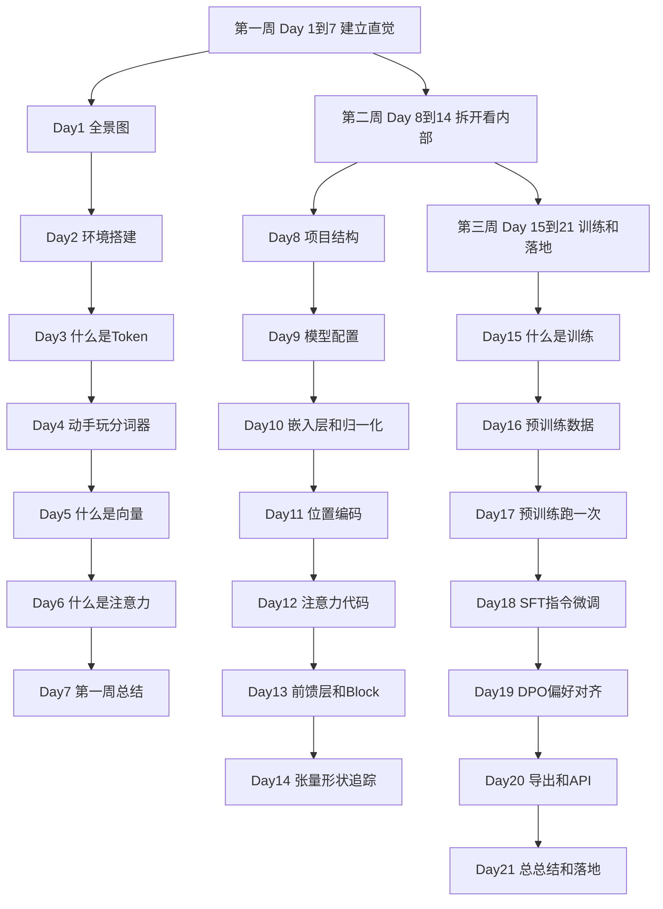
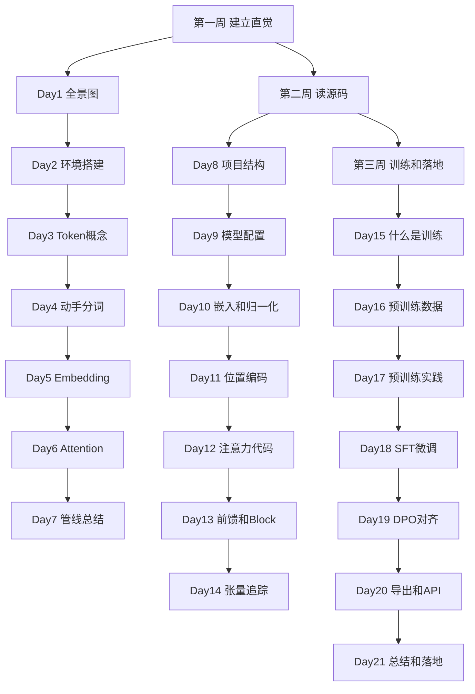

# MiniMind 21天零基础学习计划

## 这份计划适合谁

- 你完全没有大模型基础
- 你是游戏开发工程师，熟悉 Unity 和 C#
- 你想理解大模型内部在干什么，而不是只调 API
- 你的机器是 RTX 5060 8GB

## 这份计划不适合谁

- 已经了解 Transformer 基本原理的人
- 想在21天内训出 SOTA 模型的人
- 只想用 API 不想理解原理的人

## 计划核心思路

原有的7天计划对你来说跳跃太大。Day 2 就讲 RMSNorm、RoPE、Attention，相当于刚学会开引擎就让你拆变速箱。

这份21天计划做的事情很简单：

- 每天只学一个小概念
- 先建立直觉，再看代码
- 用游戏开发类比帮助理解

换句话说，这份计划的节奏是：

- 先让你知道大模型长什么样
- 再让你摸到它
- 再让你拆开它
- 最后让你理解怎么训练它和部署它

## 类比理解

你可以把这份21天计划理解成一次游戏项目的学习过程：

| 阶段 | 游戏开发类比 | 大模型学习对应 |
|------|-------------|---------------|
| 第一周 | 了解游戏引擎整体架构 | 建立大模型全景图 |
| 第二周 | 读引擎源码理解渲染管线 | 读模型源码理解数据流 |
| 第三周 | 学习资源打包和构建发布 | 理解训练链路和部署落地 |

## 总体安排



## 每天的固定节奏

每天尽量按这个顺序来：

1. 先看今日目标和类比（1分钟）
2. 再读背景知识（5分钟）
3. 做具体操作（15-30分钟）
4. 写一句自己的理解（1分钟）

如果某天觉得没完全搞懂，没关系，先往下走。很多概念会在后面几天反复出现，第二次见的时候会清楚很多。

## 每天的产出格式

每天结束时，在笔记里写一行：

```text
Day X: [用你自己的话，写一句今天学到的核心结论]
```

这一步比看起来更重要。因为它会强迫你把"看过了"变成"想过了"。

---

# 第一周 建立直觉 - 大模型是什么

这一周的目标只有一个：

- 让你脑子里有一张大模型的地图
- 知道数据从输入到输出经过了哪些站
- 不碰复杂代码，只建立直觉

类比理解：

- 你刚进一个新游戏项目组
- 第一周不会让你写战斗系统
- 而是让你先跑一遍游戏，看看每个场景长什么样

---

## Day 1 大模型全景图

### 今日一句话目标

今天只需要搞懂一件事：大模型由哪几个大模块组成，数据从输入到输出怎么流动。

### 类比理解

你可以把大模型理解成一个游戏引擎的渲染管线：

| 渲染管线 | 大模型 |
|---------|--------|
| 输入：玩家操作 | 输入：用户文本 |
| 资源加载：把贴图模型读进内存 | 分词器：把文本变成数字编号 |
| 顶点着色器：把模型坐标变成向量 | 嵌入层：把编号变成向量 |
| 像素着色器：逐像素加工颜色 | 注意力层：逐位置加工向量 |
| 输出：屏幕上的画面 | 输出：每个位置对词表的得分 |
| 帧缓冲：最终画面 | 解码器：选得分最高的词输出 |

### 背景知识

大模型的核心工作用一句话概括：

- 给定一段文字，预测下一个字是什么

听起来很简单，但要做好这件事，模型内部需要经过很多层加工。

一个典型的大模型结构是这样的：

```text
用户输入文本
  -> 分词器把文本切成 Token，变成数字编号
  -> 嵌入层把数字编号变成向量
  -> 多层 Transformer Block 逐层加工向量
     每层里面有：注意力机制 + 前馈网络
  -> 最终投影层把向量变成对词表的得分
  -> 选得分最高的词作为输出
```

你现在不需要理解每一步的细节。今天只需要记住这张地图长什么样。

### 要做的事

- [x] 阅读上面的渲染管线对比表，确认你对每个模块有一句话的理解
- [x] 把上面的流程图画一遍（手写或打字都可以）

### 验收标准

- 你能用自己的话说出：分词器、嵌入层、Transformer Block、投影层分别干什么
- 你能按顺序说出数据从输入到输出经过哪些站

### 今日一句话总结

> [已完成] 大模型由分词器、嵌入层、多层Transformer Block、投影层组成，数据从文本到数字到向量到词表得分

---

## Day 2 环境搭建 + 第一次和模型对话

### 今日一句话目标

把 MiniMind 在你的电脑上跑起来，和它说上第一句话。

### 类比理解

就像你第一次把一个 Unity 项目 clone 下来，打开编辑器，点 Play，看到游戏画面跑起来。

今天的目标不是理解引擎怎么渲染的，而是先确认项目能跑。

### 背景知识

MiniMind 是一个开源的小型语言模型项目。它的特点是：

- 模型非常小，只有约 2600 万参数
- 可以在你的 RTX 5060 8GB 上流畅运行
- 项目结构清晰，适合学习

你今天要做的事情就是：

- 装好 Python 环境
- 下载模型权重
- 在终端和模型对话

### 要做的事

1. 确认 Python 3.10 已安装

```bash
python --version
```

2. 创建虚拟环境并安装依赖

```bash
cd D:\PythonP\minimind
python -m venv .venv
.venv\Scripts\activate
pip install -r requirements.txt
```

3. 确认 GPU 可用

```bash
python -c "import torch; print(torch.cuda.is_available())"
```

如果输出 `True`，说明 GPU 准备好了。

4. 下载模型权重

如果你已经有了 `minimind-3` 文件夹，可以跳过这一步。如果没有，参考项目 README 下载。

5. 第一次对话

```bash
python eval_llm.py --load_from ./minimind-3
```

选择 `[0] 自动测试`，看模型回答几个问题。

然后选择 `[1] 手动输入`，自己问它一个问题。

### 验收标准

- [x] `torch.cuda.is_available()` 输出 `True`
- [x] 成功在终端看到模型的回复
- [x] 你自己输入了一个问题并看到了回答

### 今日一句话总结

> [已完成] 环境搭建成功，GPU 可用，成功在终端和 MiniMind 模型对话

---

## Day 3 什么是 Token

### 今日一句话目标

理解什么是 Token，为什么文本要先变成数字才能进模型。

### 类比理解

想象你在做游戏里的本地化系统：

- 你有一堆中文对话文本
- 但游戏引擎不认识汉字，它只认识编号
- 所以你需要一个对照表：把每个字或词对应到一个编号

Token 就是这个编号。

分词器（Tokenizer）就是这张对照表 + 切词规则。

### 背景知识

大模型不直接处理文字。它只处理数字。

所以第一步是：

1. 把输入文本切成一段一段的，每一段叫一个 Token
2. 给每个 Token 一个编号（Token ID）

举个例子：

```text
输入文本：  "你好世界"

分词器切成：  ["你", "好", "世", "界"]
变成编号：    [234, 567, 890, 123]
```

注意：Token 不一定是一个字。有的分词器会把常见的词整个当成一个 Token。

比如 "机器学习" 可能被切成 `["机器", "学习"]` 两个 Token，而不是四个字。

MiniMind 的词表大小是 6400。这意味着：

- 分词器最多能表示 6400 个不同的 Token
- 每个输入字或词，都会被映射到 0-6399 之间的一个编号

### 要做的事

1. 打开分词器配置文件，看看长什么样

```bash
# 看 tokenizer_config.json 的前几行
head -20 minimind-3/tokenizer_config.json
```

2. 不用理解所有内容。只需要找到这些信息：

- `vocab_size` 或词表大小：看看是多少
- `bos_token`：序列开始的标记
- `eos_token`：序列结束的标记

3. 在纸上画一个简单的流程：

```text
"你好" -> 分词器 -> [你, 好] -> [234, 567]
```

### 验收标准

- [ ] 你能用自己的话解释：Token 是什么
- [ ] 你知道为什么文本要先变成数字才能进模型
- [ ] 你知道 MiniMind 的词表大小是多少

### 今日一句话总结

> 你自己的理解写在这里

---

## Day 4 动手玩 Tokenizer

### 今日一句话目标

自己动手做一次 encode（文本变数字）和 decode（数字变文本），亲眼看到转换过程。

### 类比理解

就像你在 Unity 里用 AssetImporter 导入资源：

- 你看到一个 .png 文件被导入后变成了 Texture2D 对象
- 你能打印它的 width、height、format

今天你要看到的是：一段文字被分词器处理后，变成了什么数字。

### 背景知识

昨天你学了 Token 的概念。今天你要亲手操作分词器。

Hugging Face 的 `transformers` 库提供了一个统一的分词器接口：

- `tokenizer.encode(text)` - 把文本变成 Token ID 列表
- `tokenizer.decode(ids)` - 把 Token ID 列表变回文本
- `tokenizer.tokenize(text)` - 只做切词，不变数字

### 要做的事

1. 在终端进入 Python 交互模式

```bash
cd D:\PythonP\minimind
.venv\Scripts\activate
python
```

2. 加载分词器并做实验

```python
from transformers import AutoTokenizer

# 加载 MiniMind 的分词器
tokenizer = AutoTokenizer.from_pretrained("./minimind-3")

# encode: 文本 -> 数字
text = "你好世界"
ids = tokenizer.encode(text)
print("原文:", text)
print("Token IDs:", ids)

# decode: 数字 -> 文本
decoded = tokenizer.decode(ids)
print("还原:", decoded)

# tokenize: 只看切词结果
tokens = tokenizer.tokenize(text)
print("切词结果:", tokens)
```

3. 多试几段文字，观察：

- 一个汉字是一个 Token 还是多个？
- 标点符号会被怎么处理？
- 英文和中文的处理方式有什么不同？

### 验收标准

- [ ] 你成功运行了 encode 和 decode
- [ ] 你看到了具体的 Token ID 数字
- [ ] 你观察到了不同文本的切词差异

### 今日一句话总结

> 你自己的理解写在这里

---

## Day 5 什么是 Embedding

### 今日一句话目标

理解 Token ID 为什么还要变成向量，向量是什么。

### 类比理解

想象你在做游戏里的角色属性系统：

- 角色有一个职业编号（比如 1=战士，2=法师）
- 但光有编号不够，你需要一套属性面板来描述角色
- 属性面板有很多维度：攻击力、防御力、速度、智力...

Embedding 就是给每个 Token 编号生成一张"属性面板"。

只不过这个属性面板有 768 个维度（MiniMind 的 hidden_size），每个维度的值不是手工设计的，而是模型自己学出来的。

### 背景知识

昨天你看到了 Token ID。比如 "你" 的 ID 是 234。

但 ID 只是一个数字，它携带的信息太少了。234 和 235 之间没有语义关系。

Embedding 做的事情是：

- 给每个 Token ID 分配一个 768 维的向量
- 语义相近的词，向量也相近
- 这个向量是模型在训练过程中学出来的

举个简化例子：

```text
Token ID 234 ("你")   -> [0.12, -0.34, 0.56, ..., 0.78]  共768个数
Token ID 567 ("好")   -> [0.11, -0.33, 0.55, ..., 0.77]  共768个数
Token ID 890 ("世")   -> [0.45,  0.67, -0.12, ..., 0.33]  共768个数
```

"你"和"好"的向量会比较接近，因为它们经常一起出现。
"你"和"世"的向量会比较不同，因为它们的用法很不一样。

形状变化：

```text
输入:  Token IDs          [batch, seq_len]             例: [1, 4]
输出:  Embedding 向量      [batch, seq_len, hidden_size] 例: [1, 4, 768]
```

多出来的 `768` 这一维，就是每个 Token 的向量表示。

### 要做的事

1. 在 Python 中验证 Embedding 的形状

```python
import torch
from model.model_minimind import MiniMindConfig, MiniMindForCausalLM

cfg = MiniMindConfig(hidden_size=768, num_hidden_layers=8, use_moe=False)
model = MiniMindForCausalLM(cfg).eval()

# 随机生成 4 个 Token ID
input_ids = torch.tensor([[234, 567, 890, 123]])

# 看 Embedding 层
embed = model.model.embed_tokens
vectors = embed(input_ids)

print("输入形状:", input_ids.shape)
print("输出形状:", vectors.shape)
print("每个 Token 变成了一个", vectors.shape[-1], "维的向量")
```

2. 观察输出形状：从 `[1, 4]` 变成了 `[1, 4, 768]`

### 验收标准

- [ ] 你能用自己的话解释：Embedding 是什么
- [ ] 你知道 Embedding 后形状从 `[batch, seq]` 变成了 `[batch, seq, 768]`
- [ ] 你知道 768 是 MiniMind 的 hidden_size

### 今日一句话总结

> 你自己的理解写在这里

---

## Day 6 什么是 Attention

### 今日一句话目标

理解 Attention 的核心思想：每个 Token 可以"看"到其他 Token，然后决定自己应该被怎么更新。

### 类比理解

想象你在做一个 NPC 对话系统：

- NPC 需要根据周围的情况做出回应
- "周围的情况"包括：玩家说了什么、之前的对话历史、环境状态
- NPC 会"关注"不同的信息源，给它们不同的权重
- 重要的信息权重大，不重要的信息权重小

Attention 就是让每个 Token 做这件事：

- 每个	Token 看一遍其他所有 Token
- 决定自己应该"关注"哪些 Token
- 根据关注权重，把其他 Token 的信息混入自己

### 背景知识

Attention 有三个核心角色：Query、Key、Value。

你可以这样理解：

| 角色 | 类比 | 含义 |
|------|------|------|
| Query (Q) | NPC 的好奇心 | 每个 Token 在"找什么" |
| Key (K) | 场景里的标签 | 每个 Token "能提供什么线索" |
| Value (V) | 场景里的实际内容 | 每个 Token "具体有什么信息" |

计算过程：

1. 每个 Token 用自己的 Q 去和所有 Token 的 K 做匹配（打分）
2. 分数高的说明相关性大，给更大的权重
3. 用权重把所有 Token 的 V 加权求和
4. 得到的结果就是当前 Token 的新表示

简化例子：

```text
句子: "你 好 世 界"

当处理 "好" 这个 Token 时:
  Q_好 和 K_你 匹配 -> 分数 0.6 (你经常在好前面)
  Q_好 和 K_世 匹配 -> 分数 0.2 (关系不大)
  Q_好 和 K_界 匹配 -> 分数 0.2 (关系不大)

  新的 "好" = 0.6 * V_你 + 0.2 * V_世 + 0.2 * V_界
```

经过 Attention 后，"好" 的表示不再只是自己的向量，而是融入了上下文信息。

**关键点：Attention 不改变形状。** 输入 `[batch, seq, 768]`，输出还是 `[batch, seq, 768]`。它改变的是向量里的值，不是形状。

### 要做的事

1. 在纸上画一个简单的 Attention 示意图：
   - 4 个 Token 排成一排
   - 每个都画出箭头指向其他 Token
   - 箭头粗细代表关注权重

2. 回答这个问题：为什么 "好" 在 "你好" 里和在 "好吃" 里的意思不同？

答案：因为 Attention 机制让它看到了不同的上下文，所以最终向量不同。

### 验收标准

- [ ] 你能用自己的话解释：Attention 在做什么
- [ ] 你知道 Q、K、V 分别是什么角色
- [ ] 你知道 Attention 不改变张量形状

### 今日一句话总结

> 你自己的理解写在这里

---

## Day 7 第一周总结 - 拼出完整管线

### 今日一句话目标

把前6天学到的概念串起来，画出完整的数据流动图。

### 类比理解

就像你理解了游戏引擎的每个子系统后，终于能画出完整的帧渲染流程：

```text
玩家输入 -> 逻辑更新 -> 动画更新 -> 渲染 -> 屏幕输出
```

今天你要画出大模型的完整流程。

### 背景知识

把前6天学的东西拼在一起：

```text
用户输入文本
  |
  v
[分词器] 文本 -> Token IDs
  |  例: "你好" -> [234, 567]
  |  形状: [1, 2]
  |
  v
[Embedding 层] Token ID -> 向量
  |  例: [234, 567] -> [[...768个数...], [...768个数...]]
  |  形状: [1, 2] -> [1, 2, 768]
  |
  v
[Transformer Block 1] Attention + FeedForward
  |  每个 Token 看到其他 Token 的信息，更新自己
  |  形状不变: [1, 2, 768] -> [1, 2, 768]
  |
  v
[Transformer Block 2]
  |  再做一遍，提炼更深的信息
  |  形状不变: [1, 2, 768] -> [1, 2, 768]
  |
  v
... (MiniMind 有 8 层 Block) ...
  |
  v
[最终归一化] RMSNorm
  |  形状不变: [1, 2, 768] -> [1, 2, 768]
  |
  v
[投影层] lm_head 向量 -> 词表得分
  |  每个 Token 的 768 维向量变成 6400 个分数
  |  形状: [1, 2, 768] -> [1, 2, 6400]
  |
  v
输出: 每个位置对 6400 个候选词的得分
```

你现在看到了完整流程。重点记住两个规律：

1. **从 Embedding 到最终归一化，中间所有层的输出维度都是 768（hidden_size）**
2. **只有最后的投影层（lm_head）才把维度从 768 变成 6400（vocab_size）**

### 要做的事

1. 在纸上或电脑上画出完整的数据流动图

2. 标出每个阶段的形状变化：

```text
Token IDs    [1, seq]
Embedding    [1, seq, 768]
Block 1      [1, seq, 768]
Block 2      [1, seq, 768]
...
Block 8      [1, seq, 768]
Norm         [1, seq, 768]
lm_head      [1, seq, 6400]
```

3. 回顾第一周，用自己的话回答：

- 分词器干什么？文本变数字
- Embedding 干什么？数字变向量
- Attention 干什么？向量融入上下文
- Transformer Block 干什么？多层加工向量
- 投影层干什么？向量变词表得分

### 验收标准

- [ ] 你能画出完整的数据流动图
- [ ] 你能说出每个阶段形状怎么变化
- [ ] 你能用自己的话解释完整流程

### 今日一句话总结

> 你自己的理解写在这里

---

# 第二周 拆开 MiniMind 看内部

这一周的目标是：

- 把第一周的直觉对应到真实代码
- 逐个模块读源码，但每天只读一个
- 最后跑一次张量追踪脚本，亲眼验证

类比理解：

- 第一周你知道了引擎有渲染管线、物理系统、动画系统
- 第二周你要打开源码，看每个系统具体怎么写的
- 但不是一次全看完，而是每天只看一个模块

---

## Day 8 MiniMind 项目结构和代码地图

### 今日一句话目标

搞清楚项目里每个文件夹和关键文件是干什么的。

### 类比理解

就像你刚 clone 了一个 Unity 项目，第一件事不是打开脚本，而是看目录结构：

- Assets/ 是资源
- Scripts/ 是代码
- Scenes/ 是场景
- Plugins/ 是插件

今天你要搞清楚 MiniMind 的目录结构。

### 背景知识

MiniMind 项目的目录结构：

```text
minimind/
  |
  +-- model/              模型定义
  |   +-- model_minimind.py   主模型文件，定义了所有模型结构
  |   +-- model_lora.py       LoRA 微调相关
  |   +-- tokenizer.json      分词器词表
  |   +-- tokenizer_config.json  分词器配置
  |
  +-- trainer/            训练脚本
  |   +-- train_pretrain.py    预训练脚本
  |   +-- train_full_sft.py    SFT 指令微调脚本
  |   +-- train_dpo.py         DPO 偏好对齐脚本
  |   +-- train_tokenizer.py   分词器训练脚本
  |   +-- trainer_utils.py     训练工具函数
  |
  +-- dataset/            数据集处理
  |   +-- lm_dataset.py        数据集加载和预处理
  |
  +-- scripts/            工具脚本
  |   +-- convert_model.py     模型格式转换
  |   +-- serve_openai_api.py  OpenAI API 兼容服务
  |   +-- chat_api.py          API 调用示例
  |
  +-- eval_llm.py         推理入口（你 Day 2 跑过的）
  |
  +-- minimind-3/         预训练模型权重
  |
  +-- test/               测试脚本
      +-- day2_model_probe.py  张量追踪脚本（Day 14 会用到）
```

### 要做的事

1. 在文件管理器里打开项目，对照上面的结构浏览一遍

2. 用编辑器打开 `model/model_minimind.py`，只看文件顶部的类定义：

```text
class MiniMindConfig     配置类
class RMSNorm            归一化
class Attention          注意力
class FeedForward        前馈网络
class MOEFeedForward     MoE 前馈网络
class MiniMindBlock      单层 Block
class MiniMindModel      模型主干
class MiniMindForCausalLM 完整语言模型
```

3. 不用读代码内容。今天只需要知道：这个文件定义了哪些类，每个类叫什么名字。

### 验收标准

- [ ] 你能说出 `model/`、`trainer/`、`dataset/`、`scripts/` 分别放什么
- [ ] 你知道 `model_minimind.py` 里定义了哪些类
- [ ] 你知道推理入口是 `eval_llm.py`

### 今日一句话总结

> 你自己的理解写在这里

---

## Day 9 读模型配置 MiniMindConfig

### 今日一句话目标

读懂模型的配置参数，知道 hidden_size、vocab_size、num_hidden_layers 分别控制什么。

### 类比理解

就像你在 Unity 项目里读 ProjectSettings：

- Resolution 决定画面分辨率
- Quality Level 决定渲染精度
- Target Frame Rate 决定帧率

MiniMindConfig 就是这个模型的 "ProjectSettings"。它决定了模型的大小、精度、结构。

### 背景知识

打开 `minimind-3/config.json`，你会看到这些参数：

| 参数 | 值 | 含义 |
|------|----|------|
| hidden_size | 768 | 模型内部的数据通道宽度 |
| num_hidden_layers | 8 | Transformer Block 的层数 |
| vocab_size | 6400 | 词表大小 |
| num_attention_heads | 8 | 注意力头数 |
| num_key_value_heads | 4 | KV 头数（GQA） |
| head_dim | 96 | 每个注意力头的维度 |
| intermediate_size | 2432 | 前馈层中间维度 |
| max_position_embeddings | 32768 | 最大支持序列长度 |
| rms_norm_eps | 1e-6 | 归一化的数值稳定项 |

今天不需要全部理解。重点关注前三个：

1. **hidden_size = 768**：这是贯穿整个模型的主通道宽度。你在第一周看到的 `[batch, seq, 768]` 里的 768 就是它。
2. **num_hidden_layers = 8**：模型有 8 层 Block。每层做一轮 Attention + FeedForward。
3. **vocab_size = 6400**：词表有 6400 个 Token。这是 logits 最后一维的大小。

### 要做的事

1. 打开 `minimind-3/config.json`，逐行对照上面的表格阅读

2. 打开 `model/model_minimind.py` 的 `MiniMindConfig.__init__` 方法（大约第 40 行），看看这些参数的默认值

3. 回答这个问题：如果 hidden_size 从 768 变成 512，模型的什么会变化？

答案：模型内部所有层的向量维度都会变小，模型参数量会减少，推理速度会更快，但表达能力会降低。

### 验收标准

- [ ] 你知道 hidden_size、num_hidden_layers、vocab_size 分别是什么
- [ ] 你能解释这三个参数对模型大小的影响
- [ ] 你知道这些参数在哪里定义

### 今日一句话总结

> 你自己的理解写在这里

---

## Day 10 读 Embedding 层 + RMSNorm

### 今日一句话目标

读 Embedding 层和 RMSNorm 的源码，把第一天的直觉对应到代码。

### 类比理解

- Embedding 就像一个查找表：给一个编号，返回一串属性值
- RMSNorm 就像一个数值缩放器：把过大的值压小，过小的值抬高，保持整体稳定

### 背景知识

**Embedding 层**

在 `model_minimind.py` 的 `MiniMindModel.__init__` 里（大约第 554 行）：

```python
self.embed_tokens = nn.Embedding(config.vocab_size, config.hidden_size)
```

这就是一个 `6400 x 768` 的查找表：
- 输入：一个 Token ID（0 到 6399）
- 输出：768 维向量

**RMSNorm**

在 `model_minimind.py` 的 `RMSNorm` 类（大约第 153 行）：

```python
class RMSNorm(torch.nn.Module):
    def __init__(self, dim, eps=1e-5):
        self.weight = nn.Parameter(torch.ones(dim))

    def norm(self, x):
        return x * torch.rsqrt(x.pow(2).mean(-1, keepdim=True) + self.eps)

    def forward(self, x):
        return (self.weight * self.norm(x.float())).type_as(x)
```

RMSNorm 做的事情很简单：

1. 算每个向量的均方根（RMS）
2. 用向量除以自己的 RMS（归一化）
3. 乘以一个可学习的缩放权重

它和 LayerNorm 的区别：不减均值，只按均方根做归一化。计算更快。

**关键点：RMSNorm 不改变形状。** 输入 `[batch, seq, 768]`，输出还是 `[batch, seq, 768]`。

### 要做的事

1. 打开 `model/model_minimind.py`

2. 找到 `class RMSNorm`（第 153 行附近），读一遍 `forward` 方法

3. 找到 `self.embed_tokens`（第 554 行附近），看它的参数

4. 在 Python 中验证：

```python
import torch
from model.model_minimind import MiniMindConfig, MiniMindForCausalLM, RMSNorm

# 测试 RMSNorm
norm = RMSNorm(dim=768)
x = torch.randn(1, 4, 768)  # 模拟 4 个 Token 的向量
y = norm(x)
print("输入形状:", x.shape)
print("输出形状:", y.shape)
print("形状没变:", x.shape == y.shape)
```

### 验收标准

- [ ] 你知道 `nn.Embedding(vocab_size, hidden_size)` 是一个查找表
- [ ] 你知道 RMSNorm 做归一化但不改变形状
- [ ] 你亲手跑了验证代码，确认形状不变

### 今日一句话总结

> 你自己的理解写在这里

---

## Day 11 读 RoPE 位置编码

### 今日一句话目标

理解模型怎么知道 Token 的顺序，为什么需要位置编码。

### 类比理解

想象游戏里有一排敌人：

- 如果没有位置信息，模型只知道"有敌人"，不知道"谁在前谁在后"
- 位置编码就像给每个敌人一个世界坐标
- 有了坐标，模型就知道谁在前面谁在后面

RoPE（Rotary Position Embedding）的特殊之处在于：

- 它不是把位置信息直接加到向量上
- 而是通过旋转来编码位置
- 像是在向量的"角度"里藏了位置信息

### 背景知识

在 `model_minimind.py` 中有两个关键函数：

**precompute_freqs_cis**（第 191 行）：

- 在模型初始化时，预先算好 cos 和 sin 表
- 这个表覆盖了最大序列长度（32768 个位置）
- 推理时只需要按位置切片

**apply_rotary_pos_emb**（第 232 行）：

- 把 cos 和 sin 作用到 Q 和 K 上
- 注意：只作用到 Q 和 K，不作用到 V

为什么只作用到 Q 和 K？

因为 Attention 的分数是通过 Q 和 K 的点积算出来的。在 Q 和 K 上加位置信息，位置关系就会直接进入注意力分数。

### 要做的事

1. 打开 `model_minimind.py`

2. 找到 `precompute_freqs_cis`（第 191 行），读一遍注释

3. 找到 `apply_rotary_pos_emb`（第 232 行），看它怎么用 cos 和 sin

4. 在 Python 中看 cos 和 sin 表的形状：

```python
import torch
from model.model_minimind import MiniMindConfig, MiniMindForCausalLM

cfg = MiniMindConfig()
model = MiniMindForCausalLM(cfg).eval()

# 看预计算的位置编码表
cos_table = model.model.freqs_cos
sin_table = model.model.freqs_sin

print("cos 表形状:", cos_table.shape)
print("sin 表形状:", sin_table.shape)
print("最大支持位置数:", cos_table.shape[0])
print("head_dim:", cos_table.shape[1])
```

预期输出：

```text
cos 表形状: torch.Size([32768, 96])
sin 表形状: torch.Size([32768, 96])
最大支持位置数: 32768
head_dim: 96
```

### 验收标准

- [ ] 你知道为什么需要位置编码
- [ ] 你知道 RoPE 只作用到 Q 和 K 上
- [ ] 你知道位置编码表是在初始化时预先算好的

### 今日一句话总结

> 你自己的理解写在这里

---

## Day 12 读 Attention 层代码

### 今日一句话目标

对照第一周学的 Attention 概念，读一遍源码，把 Q、K、V 对应到真实代码。

### 类比理解

就像你理解了 NPC 行为树的概念后，终于打开了行为树脚本来读。你会发现概念和代码是一一对应的，只是代码多了很多工程细节。

### 背景知识

在 `model_minimind.py` 的 `Attention` 类（第 288 行），`forward` 方法的核心步骤：

```text
第1步  线性投影得到 q k v          第342行
第2步  把最后一维整理成多头格式       第344行
第3步  对 q 和 k 做归一化            第348行
第4步  施加 RoPE 位置编码            第350行
第5步  推理时拼接历史 KV cache       第352行
第6步  计算注意力分数                第363行
第7步  输出投影                      第371行
```

MiniMind 的 Attention 有一个特点：GQA（Grouped Query Attention）。

- Q 有 8 个头
- K 和 V 只有 4 个头
- 每 2 个 Q 头共享 1 组 K 和 V
- 这样做是为了减少显存占用

对应代码在 `repeat_kv` 函数（第 256 行），它把较少的 KV 头复制到和 Q 头数量一致。

### 要做的事

1. 打开 `model_minimind.py`，找到 `class Attention`（第 288 行）

2. 对照下面的注释，逐行读 `forward` 方法：

```python
def forward(self, x, position_embeddings, ...):
    bsz, seq_len, _ = x.shape

    # 第1步: 线性投影得到 q k v
    xq, xk, xv = self.q_proj(x), self.k_proj(x), self.v_proj(x)

    # 第2步: 整理成多头格式
    xq = xq.view(bsz, seq_len, self.n_local_heads, self.head_dim)
    xk = xk.view(bsz, seq_len, self.n_local_kv_heads, self.head_dim)

    # 第3步: 对 q 和 k 做归一化
    xq, xk = self.q_norm(xq), self.k_norm(xk)

    # 第4步: 施加 RoPE
    xq, xk = apply_rotary_pos_emb(xq, xk, cos, sin)

    # 第6步: 计算注意力分数
    scores = (xq @ xk.transpose(-2, -1)) / math.sqrt(self.head_dim)
    output = softmax(scores) @ xv

    # 第7步: 输出投影
    output = self.o_proj(output)
```

3. 不需要理解每一行。重点是确认：Q、K、V 的投影、注意力计算、输出投影，这三个步骤你能在代码里找到。

### 验收标准

- [ ] 你能在代码里找到 Q、K、V 的投影（q_proj、k_proj、v_proj）
- [ ] 你知道注意力分数是用 Q 和 K 的点积算出来的
- [ ] 你知道最终有一个输出投影（o_proj）

### 今日一句话总结

> 你自己的理解写在这里

---

## Day 13 读 FeedForward 和 MiniMindBlock

### 今日一句话目标

理解一个完整的 Transformer Block 包含哪些步骤，以及残差连接是怎么回事。

### 类比理解

把一个 Block 想象成一条技能加工链：

- 先对输入做一次处理（注意力）
- 把处理结果加回原始输入（残差连接）
- 再做一次处理（前馈网络）
- 再把结果加回去（又一次残差连接）

残差连接就像一条旁路管道：

- 主路做复杂加工
- 旁路让原始数据直接流过去
- 两路汇合时加在一起

这样做的好处是：即使中间某层学不到有用的东西，信息也不会丢失，因为有旁路兜底。

### 背景知识

**FeedForward**（第 384 行）的结构：

```text
输入 (768维)
  -> gate_proj: 768 -> 2432 (升维)
  -> 激活函数 (silu)
  -> up_proj:   768 -> 2432 (另一路升维)
  -> 两路逐元素相乘
  -> down_proj: 2432 -> 768 (降维回来)
```

前馈层的作用：在 Attention 融入上下文之后，对每个 Token 做一次独立的深加工。

升维（768 -> 2432）是为了有更多空间做复杂变换，然后再降回来。

**MiniMindBlock**（第 485 行）的结构：

```text
输入 hidden_states
  |
  v
保存一份作为残差: residual = hidden_states
  |
  v
input_layernorm -> Attention -> 输出
  |
  v
残差相加: hidden_states = attention输出 + residual
  |
  v
保存一份作为残差: residual = hidden_states
  |
  v
post_attention_layernorm -> FeedForward -> 输出
  |
  v
残差相加: hidden_states = ffn输出 + residual
  |
  v
输出 hidden_states
```

对应代码（第 503 行）：

```python
def forward(self, hidden_states, ...):
    # 第一段残差: Attention
    residual = hidden_states
    hidden_states, _ = self.self_attn(
        self.input_layernorm(hidden_states), ...
    )
    hidden_states += residual  # 残差连接

    # 第二段残差: FeedForward
    hidden_states = hidden_states + self.mlp(
        self.post_attention_layernorm(hidden_states)
    )  # 残差连接

    return hidden_states, present_key_value
```

**关键点：Block 不改变形状。** 输入 `[batch, seq, 768]`，输出还是 `[batch, seq, 768]`。

### 要做的事

1. 打开 `model_minimind.py`

2. 找到 `class FeedForward`（第 384 行），看 `forward` 方法

3. 找到 `class MiniMindBlock`（第 485 行），看 `forward` 方法

4. 在纸上画出 Block 的结构：

```text
    输入
     |
     +---- 残差旁路 ----+
     |                  |
  layernorm             |
     |                  |
  Attention             |
     |                  |
     + <----  汇合  <---+
     |
     +---- 残差旁路 ----+
     |                  |
  layernorm             |
     |                  |
  FeedForward           |
     |                  |
     + <----  汇合  <---+
     |
    输出
```

### 验收标准

- [ ] 你知道一个 Block 包含：Attention + FeedForward，各带一次残差连接
- [ ] 你知道 FeedForward 先升维再降维
- [ ] 你知道残差连接的作用是让原始信息不被丢失

### 今日一句话总结

> 你自己的理解写在这里

---

## Day 14 跑张量形状追踪脚本

### 今日一句话目标

运行追踪脚本，亲眼看到数据从 Token ID 到 Logits 的完整形状变化。

### 类比理解

就像你在 Unity 里打开 Profiler，看每一帧里每个阶段的耗时。今天你要打开模型的 Profiler，看每个阶段的张量形状。

### 背景知识

项目里已经有一个追踪脚本：`test/day2_model_probe.py`

这个脚本做的事情是：

1. 创建一个随机配置的 MiniMind 模型
2. 生成随机输入
3. 手动走一遍主链路，每一步打印张量形状

你需要做的只是运行它，然后对照第一周画的流程图，确认理解一致。

### 要做的事

1. 运行追踪脚本

```bash
cd D:\PythonP\minimind
.venv\Scripts\activate
python test/day2_model_probe.py
```

2. 观察输出，应该是类似这样：

```text
=== Day2 Model Probe ===
input_ids shape: (1, 8)
embedding shape: (1, 8, 768)
after block 1 shape: (1, 8, 768)
after block 2 shape: (1, 8, 768)
final norm shape: (1, 8, 768)
logits shape: (1, 8, 6400)
```

3. 对照你在 Day 7 画的流程图，确认每个阶段的形状都和你预期的一致

4. 回答这个问题：为什么 embedding 到 final norm 之间形状一直不变？

答案：因为 Attention、FeedForward、RMSNorm 都不改变 hidden_size 维度。只有最后的 lm_head 才把 768 映射到 6400。

### 验收标准

- [ ] 你成功运行了追踪脚本
- [ ] 你看到了每一步的形状变化
- [ ] 你能解释为什么中间形状一直不变
- [ ] 你能解释为什么最后一维变成了 6400

### 今日一句话总结

> 你自己的理解写在这里

---

# 第三周 训练链路和落地

这一周的目标是：

- 理解模型是怎么被训练出来的
- 理解预训练、SFT、DPO 三种训练分别干什么
- 理解怎么把训练好的模型变成可用的服务

类比理解：

- 第一周你知道了引擎怎么跑
- 第二周你知道了引擎怎么写的
- 第三周你要知道引擎怎么调校和发布

---

## Day 15 什么是训练

### 今日一句话目标

用直觉理解"训练"到底在做什么，什么是 Loss。

### 类比理解

把训练想象成游戏数值平衡调试：

- 你有一套技能伤害公式
- 你希望实际的伤害输出接近你的设计目标
- 每次测试后，你根据偏差调整公式参数
- 偏差越小，说明参数越好

训练做的事情完全一样：

- 模型有一堆参数（权重）
- 你给模型一个输入，它产生一个输出（预测下一个 Token）
- 你拿输出和正确答案比较，算出差距（Loss）
- 根据差距调整参数（梯度下降）
- 重复很多次，Loss 越来越小

**Loss 就是"模型输出和正确答案之间的差距"。**

Loss 越小，说明模型的预测越准确。

### 背景知识

训练的核心循环：

```text
1. 从数据集取出一批样本 (input_ids, labels)
2. 把 input_ids 送进模型，得到 logits
3. 用 logits 和 labels 计算 Loss
4. 根据 Loss 算梯度
5. 用梯度更新模型参数
6. 重复
```

其中第3步最关键。不同训练阶段的区别，本质上就是 Loss 的计算方式不同：

| 训练阶段 | Loss 计算方式 | 类比 |
|---------|-------------|------|
| 预训练 | 预测下一个 Token，和真实下一个 Token 比较 | 学会续写 |
| SFT | 只在 assistant 回复部分计算 Loss | 学会回答问题 |
| DPO | 比较 chosen 和 rejected 的分数差异 | 学会选择更好的回答 |

今天不需要理解公式细节。只需要知道：

- **训练就是不断调整参数，让 Loss 变小**
- **不同训练阶段的区别在于 Loss 怎么算**

### 要做的事

1. 回忆 Day 7 的完整管线：`input_ids -> embedding -> blocks -> logits`

2. 思考：logits 的形状是 `[batch, seq, 6400]`，这 6400 个数是什么？

答案：是每个位置对 6400 个候选词的得分。得分最高的词就是模型"最想"输出的。

3. 思考：如果正确答案是 Token ID 100，但模型给 Token ID 100 的得分很低，Loss 就会怎样？

答案：Loss 会很大。训练的目标就是让模型给正确答案的得分变高。

### 验收标准

- [ ] 你知道 Loss 是"模型输出和正确答案之间的差距"
- [ ] 你知道训练的核心循环是：前向传播 -> 算 Loss -> 算梯度 -> 更新参数
- [ ] 你知道不同训练阶段的区别在于 Loss 怎么算

### 今日一句话总结

> 你自己的理解写在这里

---

## Day 16 预训练数据格式

### 今日一句话目标

看看预训练的数据长什么样，理解 next token prediction 的含义。

### 类比理解

想象你在教一个人学说话：

- 你给他看大量文本："今天天气很好，"
- 你让他猜下一个字
- 如果他猜"我"，你告诉他应该是"明"（因为"明天"更常见）
- 不断重复，他慢慢学会了语言的规律

预训练做的事情就是这件事。数据就是大量文本，模型的任务就是猜下一个 Token。

### 背景知识

预训练的数据格式非常简单：

```json
{"text": "今天天气很好，适合出去散步。"}
```

每一行就是一个 JSON 对象，只有一个 `text` 字段。

对应的 Dataset 类是 `PretrainDataset`（在 `dataset/lm_dataset.py` 第 37 行）：

```python
class PretrainDataset(Dataset):
    def __getitem__(self, index):
        sample = self.samples[index]
        # 把文本变成 Token ID
        tokens = self.tokenizer(str(sample['text']), ...).input_ids
        # 前后加上特殊标记
        tokens = [bos_token_id] + tokens + [eos_token_id]
        # 补齐到固定长度
        input_ids = tokens + [pad_token_id] * (max_length - len(tokens))
        # labels 就是 input_ids 本身
        labels = input_ids.clone()
        # padding 位置不计算 Loss
        labels[input_ids == pad_token_id] = -100
        return input_ids, labels
```

关键点：

- **labels 就是 input_ids 本身**
- 训练时，用 `input_ids[:-1]`（去掉最后一个）预测 `labels[1:]`（去掉第一个）
- 也就是用当前位置预测下一个位置
- `-100` 的位置不参与 Loss 计算

### 要做的事

1. 打开 `dataset/lm_dataset.py`

2. 找到 `class PretrainDataset`（第 37 行），读 `__getitem__` 方法

3. 回答这个问题：为什么 labels 里 padding 位置要设成 `-100`？

答案：因为 padding 是无意义的填充，不应该参与 Loss 计算。PyTorch 的 `CrossEntropyLoss` 默认忽略 `-100`。

4. 回答这个问题：为什么 labels 就等于 input_ids？

答案：因为训练时用 `input_ids[i]` 预测 `labels[i+1]`（即 `input_ids[i+1]`）。也就是用当前位置的输入预测下一个位置的正确答案。

### 验收标准

- [ ] 你知道预训练数据长什么样（一行一个 `{"text": "..."}`）
- [ ] 你知道 labels 就是 input_ids 的位移版本
- [ ] 你知道 `-100` 表示不参与 Loss 计算

### 今日一句话总结

> 你自己的理解写在这里

---

## Day 17 预训练跑一次

### 今日一句话目标

跑一次预训练脚本，看到 Loss 数字在下降。

### 类比理解

就像你在 Unity 里第一次跑自动数值平衡：

- 你不需要等它收敛到完美
- 你只需要看到数值在变化
- 确认流程是通的

今天的目标不是训出好模型，而是看到训练在发生。

### 背景知识

预训练脚本是 `trainer/train_pretrain.py`。

因为你的机器是 RTX 5060 8GB，你不需要（也不应该）跑完整训练。你只需要：

- 用最小的数据量
- 跑几个 step
- 看到 Loss 在打印

训练的核心流程：

```text
加载数据
  -> 构建 DataLoader
  -> 循环每个 batch:
      -> input_ids 送进模型
      -> 得到 logits
      -> 用 logits 和 labels 算 Loss
      -> 反向传播
      -> 更新参数
      -> 打印 Loss
```

### 要做的事

1. 打开 `trainer/train_pretrain.py`，只看主函数的结构，不需要逐行读懂

2. 找到训练循环（通常是一个 `for` 循环），确认你能找到打印 Loss 的地方

3. 如果你想跑，先确认数据集已经下载好。如果还没下载，今天只读代码也完全可以。

4. 重点关注：你能找到 Loss 的计算位置吗？

在 `model_minimind.py` 的 `MiniMindForCausalLM.forward`（第 638 行）：

```python
if labels is not None:
    x, y = logits[..., :-1, :].contiguous(), labels[..., 1:].contiguous()
    loss = F.cross_entropy(x.view(-1, x.size(-1)), y.view(-1), ignore_index=-100)
```

这三行就是 Loss 的计算：

- 用 `logits[:-1]`（去掉最后一个位置）预测 `labels[1:]`（去掉第一个位置）
- `cross_entropy` 计算预测和真实值之间的差距
- `ignore_index=-100` 忽略 padding 位置

### 验收标准

- [ ] 你知道预训练脚本在哪里
- [ ] 你知道 Loss 是怎么算出来的（cross_entropy）
- [ ] 你知道 `ignore_index=-100` 的作用

### 今日一句话总结

> 你自己的理解写在这里

---

## Day 18 SFT 指令微调

### 今日一句话目标

理解 SFT 和预训练的区别：SFT 只在 assistant 回复的部分计算 Loss。

### 类比理解

把预训练和 SFT 想象成两种教学方式：

- **预训练**：给模型看大量小说，让它学会"文字怎么续写"
- **SFT**：给模型看对话范例，让它学会"当用户提问时，应该怎么回答"

SFT 的关键区别在于：

- 不是所有位置都计算 Loss
- 只在 assistant 的回复部分计算 Loss
- 用户的提问部分不参与训练

为什么要这样？

因为你想让模型学的是"怎么回答"，而不是"怎么提问"。

### 背景知识

SFT 的数据格式：

```json
{
  "conversations": [
    {"role": "user", "content": "什么是光合作用"},
    {"role": "assistant", "content": "光合作用是植物利用阳光将二氧化碳和水转化为有机物和氧气的过程。"}
  ]
}
```

对应的 Dataset 类是 `SFTDataset`（在 `dataset/lm_dataset.py` 第 58 行）。

它有一个关键的 `generate_labels` 方法（第 88 行）：

```python
def generate_labels(self, input_ids):
    labels = [-100] * len(input_ids)  # 默认全部忽略
    # 找到 assistant 回复的起始位置
    while i < len(input_ids):
        if input_ids[i:i + len(bos_id)] == bos_id:
            start = i + len(bos_id)  # assistant 回复开始
            # ...找到回复结束位置...
            # 只有 assistant 回复部分设为可训练
            for j in range(start, end):
                labels[j] = input_ids[j]
    return labels
```

这段代码做的事情：

1. 先把所有位置标记为 `-100`（不训练）
2. 找到 assistant 回复的起始标记
3. 只把 assistant 回复部分设为对应的 input_id（参与训练）

### 要做的事

1. 打开 `dataset/lm_dataset.py`

2. 找到 `class SFTDataset`（第 58 行），看 `generate_labels` 方法

3. 对比 `PretrainDataset` 的 labels 生成方式，回答：

- 预训练的 labels：所有位置都参与（除了 padding）
- SFT 的 labels：只有 assistant 回复位置参与

4. 回答：如果你把 SFT 的 labels 改成和预训练一样（全部参与），会怎样？

答案：模型也会学用户的提问方式，这可能导致模型学会"模仿用户提问"而不是"回答问题"。

### 验收标准

- [ ] 你知道 SFT 数据长什么样（conversations 格式）
- [ ] 你知道 SFT 只在 assistant 回复部分计算 Loss
- [ ] 你知道为什么只监督 assistant 部分

### 今日一句话总结

> 你自己的理解写在这里

---

## Day 19 DPO 偏好对齐

### 今日一句话目标

理解 DPO 的核心思想：不是让模型学"什么是好的回答"，而是让模型学"好回答比差回答好多少"。

### 类比理解

想象你在做游戏平衡的 A/B 测试：

- 玩家对方案 A 和方案 B 各打一个满意度分
- 方案 A 分数高（chosen），方案 B 分数低（rejected）
- 你不是让模型直接学方案 A 的内容
- 而是让模型学会：方案 A 比方案 B 好

DPO 就是这种比较式学习：

- 给模型两个回答：一个好（chosen），一个差（rejected）
- 让模型学会：好回答的得分应该比差回答高
- 不是简单地背好回答，而是理解"好在哪里"

### 背景知识

DPO 的数据格式：

```json
{
  "chosen": [
    {"role": "user", "content": "什么是光合作用"},
    {"role": "assistant", "content": "光合作用是植物利用阳光..."}
  ],
  "rejected": [
    {"role": "user", "content": "什么是光合作用"},
    {"role": "assistant", "content": "光合作用就是呼吸..."}
  ]
}
```

注意：用户的提问是一样的，只有 assistant 的回答不同。

DPO 的 Loss（在 `trainer/train_dpo.py` 中）核心思想：

```text
1. 把 chosen 回答送进模型，算 log_probs_chosen
2. 把 rejected 回答送进模型，算 log_probs_rejected
3. DPO Loss = -log(sigmoid(log_probs_chosen - log_probs_rejected))
```

含义：

- 如果模型认为 chosen 比 rejected 好很多，Loss 接近 0（已经学会了）
- 如果模型认为两者差不多，Loss 较大（还需要学习）
- 如果模型反而觉得 rejected 更好，Loss 很大（方向错了）

还有一个关键概念：**ref_model（参考模型）**。

- ref_model 是 DPO 训练前的模型副本
- 它不参与训练，只是作为基准
- DPO Loss 里会减去 ref_model 的 log_probs
- 这样做是为了防止模型在"偏向好回答"的同时偏离原始模型太远

### 要做的事

1. 打开 `dataset/lm_dataset.py`

2. 找到 `class DPODataset`（第 122 行），看 `__getitem__` 方法

3. 注意它返回了什么：`x_chosen`、`y_chosen`、`x_rejected`、`y_rejected`

4. 打开 `trainer/train_dpo.py`，搜索 `dpo_loss` 或 `log_probs`，看 Loss 是怎么用 chosen 和 rejected 算出来的

5. 不需要理解公式。只需要确认：你能看到代码里同时处理了 chosen 和 rejected 两条数据。

### 验收标准

- [ ] 你知道 DPO 数据包含 chosen 和 rejected 两个回答
- [ ] 你知道 DPO 是在比较两个回答的得分差异
- [ ] 你知道 ref_model 是一个不参与训练的基准模型

### 今日一句话总结

> 你自己的理解写在这里

---

## Day 20 模型导出 + API 服务

### 今日一句话目标

理解训练好的模型怎么变成一个可以调用的 API 服务。

### 类比理解

就像你在 Unity 里做完游戏后需要：

1. 打包构建（Build）：把 Unity 格式转成可执行文件
2. 接入 SDK：让其他程序能调用你的游戏功能

模型也一样：

1. 导出：把训练好的 PyTorch 权重转成通用格式（比如 Hugging Face 格式）
2. 服务化：把模型包装成 OpenAI API 兼容的接口

### 背景知识

**模型格式转换**

`scripts/convert_model.py` 做的事情：

- 把 PyTorch 的 `.pth` 权重转成 Hugging Face 的格式
- 转换后可以用 `transformers` 库直接加载
- 也可以被很多部署工具直接使用

**API 服务**

`scripts/serve_openai_api.py` 做的事情：

- 启动一个 HTTP 服务
- 兼容 OpenAI 的 `/v1/chat/completions` 接口
- 其他程序可以用调用 ChatGPT 的方式调用你的本地模型

这意味着：

- 你自己的游戏工具链如果已经能调用 OpenAI API
- 只需要改一下 base_url，就能无缝切换到本地模型
- 不需要改任何其他代码

### 要做的事

1. 打开 `scripts/convert_model.py`，看它的主要逻辑（不需要逐行读懂）

2. 打开 `scripts/serve_openai_api.py`，看它怎么定义路由

3. 思考一个场景：如果你的 Unity 工具需要 AI 生成 NPC 对话，你会怎么接入？

简单的接入路径：

```text
Unity 工具
  -> HTTP 请求到 localhost:8000/v1/chat/completions
  -> 本地 MiniMind 模型推理
  -> 返回 AI 生成的对话文本
```

### 验收标准

- [ ] 你知道模型导出脚本在哪里
- [ ] 你知道 API 服务的入口脚本在哪里
- [ ] 你知道 API 兼容 OpenAI 的接口格式

### 今日一句话总结

> 你自己的理解写在这里

---

## Day 21 总总结 + 落地场景

### 今日一句话目标

回顾21天的学习，确认自己建立起了完整的认知地图，并写出一个可落地的应用方向。

### 类比理解

就像你完成了一个游戏引擎的学习后，不是要成为引擎开发者，而是要知道：

- 引擎的每个模块在干什么
- 当你需要扩展时，去哪里改
- 当出问题时，去哪里排查

你学 MiniMind 的目标也一样：

- 不是要成为大模型研究者
- 而是要知道大模型内部怎么运转
- 当你需要接入自己的项目时，知道从哪里下手

### 背景知识

回顾21天的核心收获：

**第一周：直觉建立**

```text
文本 -> Token IDs -> 向量 -> 多层加工 -> 词表得分 -> 选词输出
```

**第二周：代码对应**

```text
model_minimind.py 定义了整条链路
  MiniMindConfig   配置
  embed_tokens     查找表
  RMSNorm          归一化
  RoPE             位置编码
  Attention        上下文融合
  FeedForward      深加工
  MiniMindBlock    一个完整层
  lm_head          投影到词表
```

**第三周：训练链路**

```text
预训练  学语言规律       所有位置计算 Loss
SFT    学回答问题       只在 assistant 部分计算 Loss
DPO    学偏好选择       比较 chosen 和 rejected 的差异
```

### 落地场景建议

以下是你可以考虑的落地方向：

**场景一：本地 NPC 对话生成**

- 用 MiniMind 作为 NPC 对话的初稿生成器
- 通过 OpenAI API 兼容接口接入你的游戏工具
- 生成后再由策划微调

**场景二：本地任务描述生成**

- 用 MiniMind 自动生成任务描述文本
- 输入任务参数，输出一段自然的任务描述

**场景三：编辑器工具集成**

- 在 Unity 编辑器里加一个 AI 助手面板
- 通过 HTTP 调用本地 MiniMind 服务
- 不依赖外部 API，离线也能用

### 要做的事

1. 回顾21天的学习笔记（你每天写的一句话总结）

2. 用自己的话，完整描述一遍大模型从输入到输出的流程

3. 写出一个你想做的落地场景：

```text
我的落地场景：
我想用 MiniMind 来 [做什么]，
接入方式是 [怎么接]，
预期效果是 [什么效果]。
```

### 验收标准

- [ ] 你能用一段话描述大模型从输入到输出的完整流程
- [ ] 你知道预训练、SFT、DPO 分别在做什么
- [ ] 你写出了至少一个可落地的应用方向

### 今日一句话总结

> 你自己的理解写在这里

---

# 附录

## 21天知识地图总览



## 每日一句话总结模板

```text
Day 1:  [你对大模型全景图的理解]
Day 2:  [你第一次和模型对话的感受]
Day 3:  [你对 Token 的理解]
Day 4:  [你对 encode 和 decode 的观察]
Day 5:  [你对 Embedding 的理解]
Day 6:  [你对 Attention 的理解]
Day 7:  [你对完整管线的理解]
Day 8:  [你对项目结构的理解]
Day 9:  [你对模型配置参数的理解]
Day 10: [你对 Embedding 层和 RMSNorm 的理解]
Day 11: [你对位置编码的理解]
Day 12: [你对 Attention 代码的理解]
Day 13: [你对 FeedForward 和 Block 的理解]
Day 14: [你对张量形状追踪的观察]
Day 15: [你对训练概念的理解]
Day 16: [你对预训练数据的理解]
Day 17: [你对预训练实践的理解]
Day 18: [你对 SFT 的理解]
Day 19: [你对 DPO 的理解]
Day 20: [你对导出和 API 的理解]
Day 21: [你对落地场景的思考]
```

## 关键文件索引

| 文件 | 用途 | 相关 Day |
|------|------|----------|
| `model/model_minimind.py` | 模型定义 | Day 8-14 |
| `model/tokenizer.json` | 分词器词表 | Day 3-4 |
| `minimind-3/config.json` | 模型配置 | Day 9 |
| `eval_llm.py` | 推理入口 | Day 2 |
| `dataset/lm_dataset.py` | 数据集处理 | Day 16-19 |
| `trainer/train_pretrain.py` | 预训练脚本 | Day 17 |
| `trainer/train_full_sft.py` | SFT 脚本 | Day 18 |
| `trainer/train_dpo.py` | DPO 脚本 | Day 19 |
| `scripts/convert_model.py` | 模型导出 | Day 20 |
| `scripts/serve_openai_api.py` | API 服务 | Day 20 |
| `test/day2_model_probe.py` | 张量追踪 | Day 14 |

## 引用说明

- MiniMind 仓库主页：https://github.com/jingyaogong/minimind
- MiniMind README：https://github.com/jingyaogong/minimind/blob/master/README.md
- Attention Is All You Need：https://arxiv.org/abs/1706.03762
- RoFormer Rotary Position Embedding：https://arxiv.org/abs/2104.09864
- DPO 论文：https://arxiv.org/abs/2305.18290
- Hugging Face Tokenizers 文档：https://huggingface.co/docs/tokenizers/index
